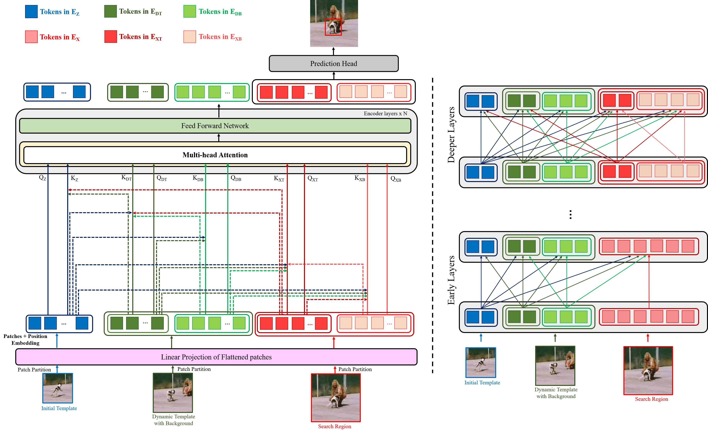

# OIFTrack
Transformer Tracking using Optimized Information Flow

[[Models](https://drive.google.com/drive/folders/1dkHhUgew8SxncIo-fMbRTf_BZH7bTHqF?usp=sharing)][[Raw Results](https://drive.google.com/drive/folders/1HnIBMin7mnVrTmAvpkrhqo1befije315?usp=sharing)]


<p align="center">
  
</p>

## Environment
  Our experiments are conducted with Ubuntu 18.04.6 and CUDA 11.4 (python=3.8).

## Preparation
  - Download the pre-trained [MAE ViT-Base weights](https://dl.fbaipublicfiles.com/mae/pretrain/mae_pretrain_vit_base.pth) and place the file into the `pretrained_models` directory under OIFTrack project path.
  - Download the training datasets ( [GOT-10k](http://got-10k.aitestunion.com/downloads), [TrackingNet](https://github.com/SilvioGiancola/TrackingNet-devkit), [LaSOT](http://vision.cs.stonybrook.edu/~lasot/download.html), [COCO2017](https://cocodataset.org/#download)) and testing dataset ([UAV123](https://cemse.kaust.edu.sa/ivul/uav123)) to your disk.
     
        Organized directory should look like:

          ```
          --GOT10k/
          	|--test
          	|--train
          	|--val
          --TrackingNet/
          	|--TRAIN_0
          	|...
          	|--TEST
          --LaSOT/
          	|--airplane-1
          	|...
          	|--zebra-20
          --COCO/
          	|--annotations
          	|--images
          --UAV123/
          	|--anno
          	|--data_seq
          ```

  - Run the following command to set paths for this project
    ```
    python tracking/create_default_local_file.py --workspace_dir . --data_dir ./data --save_dir ./output
    ```
    After running this command, you can also modify paths by editing these two files
    ```
    lib/train/admin/local.py  # paths about training
    lib/test/evaluation/local.py  # paths about testing
            
    ```
## Training
- Multiple GPU training
  ```
  python tracking/train.py --script oiftrack --config vitb_256_mae_ce_all_dataset --save_dir ./output --mode multiple --nproc_per_node 4 --use_wandb 1
  ```

  Replace `--config` with the desired model config under `experiments/oiftrack`. We use [wandb](https://github.com/wandb/client) to record detailed training logs.
  
- Single GPU training
  ```
  python tracking/train.py --script oiftrack --config vitb_256_mae_ce_all_dataset --save_dir ./output --mode single --use_wandb 1
  ```
- For GOT-10k Training, set the --config to vitb_256_mae_ce_got10k.

## Evaluation

- Make sure you have prepared the trained model or download the model weights from [Google Drive](https://drive.google.com/drive/folders/1dkHhUgew8SxncIo-fMbRTf_BZH7bTHqF?usp=sharing) (Put the downloaded weights on `$PROJECT_ROOT$/output/checkpoints/train/oiftrack`)
  - GOT10K-test
    ```
    python tracking/test.py oiftrack vitb_256_mae_ce_got10k --dataset got10k_test --threads 0 --num_gpus 1
    python lib/test/utils/transform_got10k.py --tracker_name oiftrack --cfg_name vitb_256_mae_ce_got10k
    ```
    Then upload `$PROJECT_ROOT$/output/test/tracking_results/oiftrack/vitb_256_mae_ce_got10k/got10k_submit.zip` to the [online evaluation server](http://got-10k.aitestunion.com/submit_instructions).
  
  - TrackingNet
    ```
    python tracking/test.py oiftrack vitb_256_mae_ce_all_dataset --dataset trackingnet --threads 0 --num_gpus 1
    python lib/test/utils/transform_trackingnet.py --tracker_name oiftrack vitb_256_mae_ce_all_dataset
    ```
    Then upload `$PROJECT_ROOT$/output/test/tracking_results/oiftrack/vitb_256_mae_ce_all_dataset/trackingnet_submit.zip` to the [online evaluation server](https://eval.ai/web/challenges/challenge-page/1805/overview).
    
- LaSOT
    ```
    python tracking/test.py oiftrack vitb_256_mae_ce_all_dataset --dataset lasot --threads 0 --num_gpus 1
    ```
    Then evaluate the raw results using the [official MATLAB toolkit](https://github.com/HengLan/LaSOT_Evaluation_Toolkit).
  
  - UAV123
    ```
    python tracking/test.py oiftrack vitb_256_mae_ce_all_dataset --dataset uav --threads 0 --num_gpus 1
    python tracking/analysis_results.py
    ```

